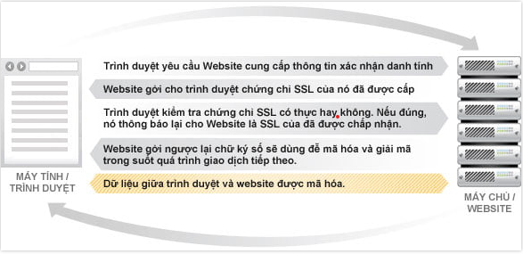

# SSL

## Giới thiệu chung

- SSL là viết tắt của từ Secure Sockets Layer. SSL là tiêu chuẩn của công nghệ bảo mật, truyền thông mã hóa giữa máy chủ Web server và trình duyệt. 

- SSL đảm bảo rằng dữ liệu truyền tải giữa máy chủ và trình duyệt của người dùng đều riêng tư và toàn vẹn

- Chức thực số SSL cài trên website của doanh nghiệp cho phép khách hàng khi truy cập có thể xác minh được tính xác thực, tin cậy của website, đảm bảo mọi dữ liệu, thông tin trao đổi giữa website và khách hàng được mã hóa, tránh nguy cơ bị can thiệp

## Một số định nghĩa, thuật ngữ thường gặp về SSL

CA là tổ chức phát hành các chứng thực số cho người dùng, doanh nghiệp, máy chủ, mã code, phần mềm. Nhà cung cấp chứng thực số đóng vai trò là bên thứ ba để cho quá trình trao đổi thông tin an toàn

**Domain Validation (DV SSL)**

Chứng thư số SSL chứng thực cho Domain Name - Website. Khi 1 Website sử dụng DV SSL thì sẽ được xác thực tên domain, website đã được mã hóa an toàn khi trao đổi dữ liệu

**Organization Validation (OV SSL)**

Chứng thư số SSL chứng thực cho Website và xác thực doanh nghiệp đang sở hữu Website đó

**Extended Validation (EV SSL)**

Cho khách hàng của bạn thấy Website đang sử dụng chứng thư SSL có độ bảo mật cao nhất và được rà soát pháp lý kỹ càng

**Subject Alternative Names (SANs SSL)**

Nhiều tên miền hợp nhất trong 1 chứng thư số:
- 1 chứng thư số SSL tiêu chuẩn chỉ bảo mật cho duy nhất 1 tên miền đã được kiểm định. Lựa chọn thêm SANs chỉ với chứng thư duy nhất đảm bảo cho nhiều tên miền con. SANs mang lại sự linh hoạt cho người sử dụng, dễ dàng hơn trong việc cài đặt, sử dụng và quản lý chứng thư số SSL. Ngoài ra, SANs có tính bảo mật cao hơn Wildcard SSL, đáp ứng chính xác yêu cầu an toàn đối với máy chủ và làm giảm tổng chi phí triển khai SSL tới tất cả các tên miền và máy chủ cần thiết
- Chứng thư số SSL SANs có thể tích hợp với tất cả các loại chứng thư số SSL của Global Sign bao gồm: DV SSL, OV SSL, EV SSL

**Wildcard SSL Certificate (Wildcard SSL)**

Sản phẩm lý tưởng dành cho các cổng thương mại điện tử. Mỗi e-store là một sub-domain và được chia sẻ trên một hoặc nhiều địa chỉ IP. Khi đó, để triển khai giải pháp bảo mật giao dịch trực tuyến (đặt hàng, thanh toán, đăng ký và đăng nhập tài khoản...) bằng SSL, chúng ta có thể dùng duy nhất 1 chứng chỉ số Wildcard cho tên miền chính của website và tất cả sub-domain

## Lý do sử dụng SSL

Khi bạn đăng ký tên miền để sử dụng các dịch vụ website, email, v.v... luôn có những lỗ hổng bảo mật cho hacker tấn công, SSL bảo vệ website và khách hàng của bạn
- *An toàn dữ liệu*: dữ liệu không bị thay đổi bởi hacker
- *Bảo mật dữ liệu*: dữ liệu được mã hóa và chỉ người nhận đích thực mới có thể giải mã
- *Chống chối bỏ*: đối tượng thực hiện gửi dữ liệu không thể phủ nhận dữ liệu của mình

Nhiều lợi ích khi sử dụng SSL:
- Xác thực website, giao dịch
- Nâng cao hình ảnh, thương hiệu và uy tín doanh nghiệp
- Bảo mật các giao dịch giữa khách hàng và doanh nghiệp, các dịch vụ truy nhập hệ thống
- Bảo mật webmail và các ứng dụng như outlook web access, exchange, và office communication server
- Bảo mật các ứng dụng ảo hóa hoặc các ứng dụng liên quan đến điện toán đám mây
- Bảo mật dịch vụ FTP
- Bảo mật truy cập control panel
- Bảo mật các dịch vụ truyền dữ liệu trong mạng nội bộ
- Bảo mật VPN Access Server, Citrix Access Gateway,...
- Website không được xác thực và bảo mật sẽ luôn ẩn chứa nguy cơ bị xâm nhập dữ liệu, dẫn đến hậu quả khách hàng không tin tưởng sử dụng dịch vụ