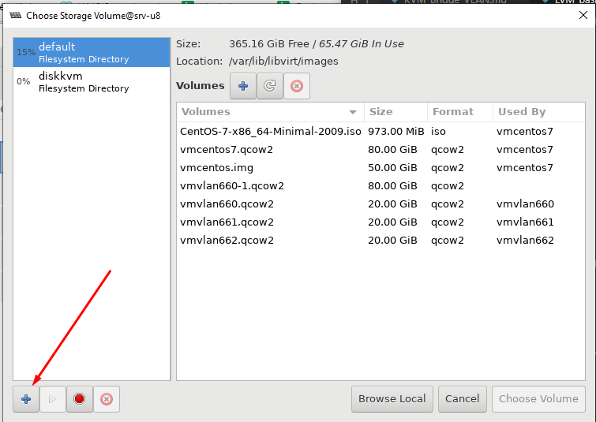

# Cấu hình và sử dụng LVM

### 1. Chuẩn bị

- Cắm ổ -> Import Foreign Volume -> Cấu hình RAID

### 2. Tạo và định dạng phân vùng

- Đầu tiên kiểm tra xem ổ đã online chưa 

```sh
lsblk
```

- Tạo phân vùng cho ổ đĩa mới gắn

```sh
fdisk /dev/sdb/
```

- Sau đó, lệnh này sẽ hỏi về các tùy chọn, 1 số tùy chọn khả dụng bao gồm:
 - n - Tạo phân vùng
 - p - In bảng phân vùng
 - d - Xóa phân vùng
 - q - Thoát mà không save
 - w - Lưu lại thay đổi và thoát

- Thông thường, sau khi gõ lệnh ```fdisk``` ta sẽ gõ lần lượt các option theo thứ tự sau:

```sh
n
p
1
w
```

- Định dạng lại phân vùng vừa tạo:

```sh
mkfs.ext4 /dev/sdb1
```

### 3. Cấu hình LVM

- Tạo Physical volume:

```sh
pvcreate /dev/sdb1
```

- Tạo Volume Group

```sh
vgcreate vg_kvm /dev/sdb1
```

- Tạo Logical Volume

```sh
lvcreate -L 200G -n lv_kvmdisk vg_kvm
```

- Định dạng lại Logical Volume vừa tạo

```sh
mkfs.ext4 /dev/vg_kvm/lv_kvmdisk
```

- Mount volume vừa tạo

```sh
mkdir /kvmdata
mount /dev/vg_kvm/lv_kvmdisk /kvmdata
```

- Thêm vào fstab để reboot thì auto mount:

```sh
# Check blkid để xem UUID của ổ vừa tạo là gì sau đó thêm vào fstab
echo "UUID=<UUID_here>  /kvmdata    ext4    defaults    0   0" >> /etc/fstab
```

### Add pool để sử dụng cho KVM

- Lần lượt thực hiện như sau:





- OK vậy là có thể chọn pool và tạo VM vào disk mới được rồi

### Extend disk máy ảo

- Tắt máy, add thêm ổ


- Thực hiện lần lượt các bước như sau:

```sh
fdisk /dev/vdb
mkfs.etx4 /dev/vdb1
pvcreate /dev/vdb1
vgextend centos /dev/vdb1
lvextend -L +80G /dev/centos/root
xfs_growfs /dev/centos/root
df -h #kiểm tra thông số ổ cứng
```

- Done