# Cài đặt và sử dụng Hyper-V trên hệ điều hành Windows Server 2019

### Cài đặt

- Chọn ```Add roles and features```


- Chọn ```Role-based or feature-based installation``` -> ```Next```

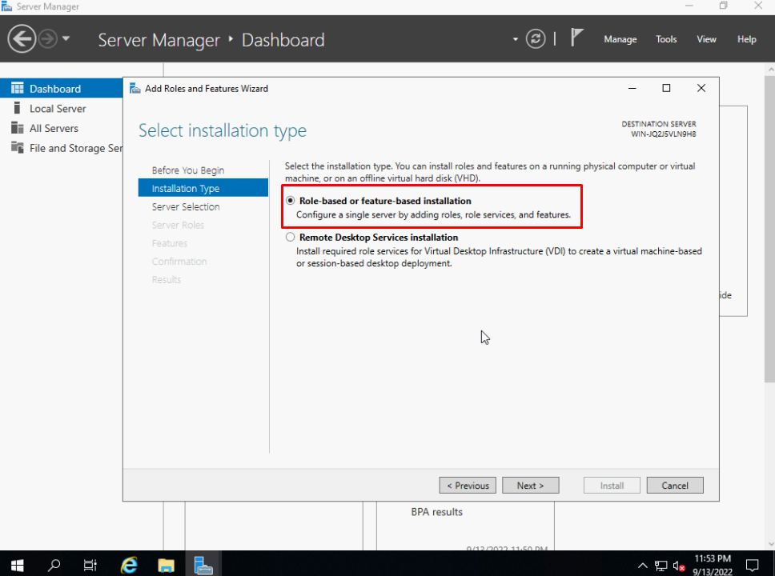

- Chọn host muốn thêm service vào


- Tick chọn ```Hyper-V``` -> ```Add feature``` -> ```Next```

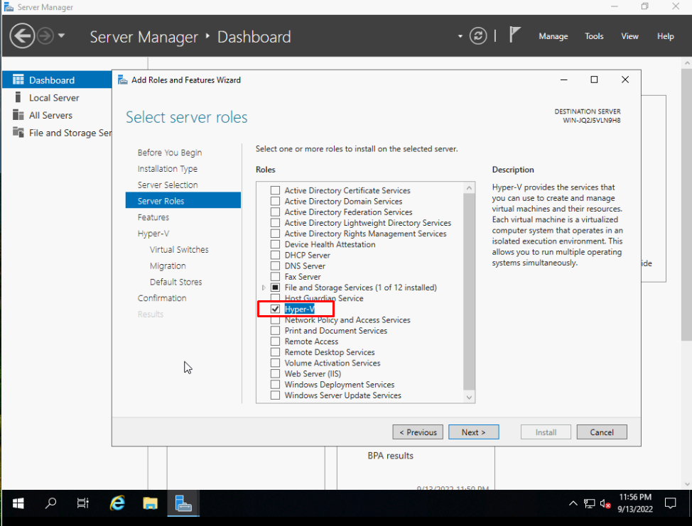

- ```Next```

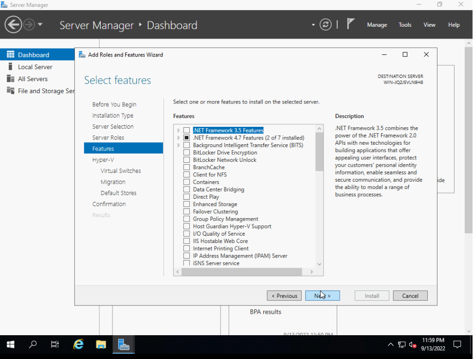

- ```Next```


- Tại phần Virtual Switches, chọn 1 card mạng -> ```Next```

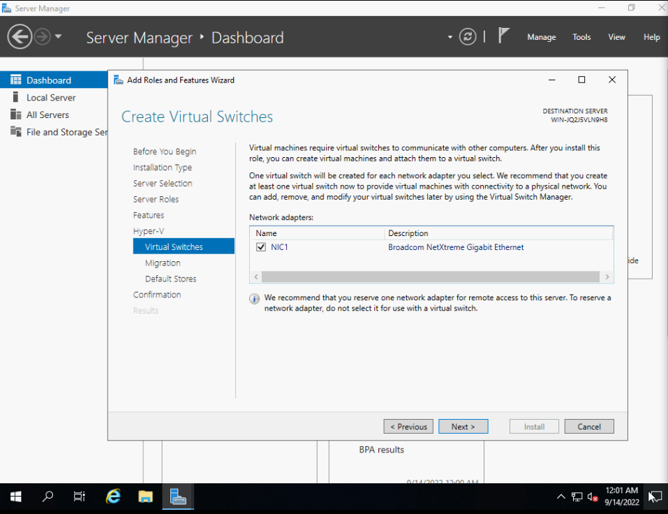

- ```Next```

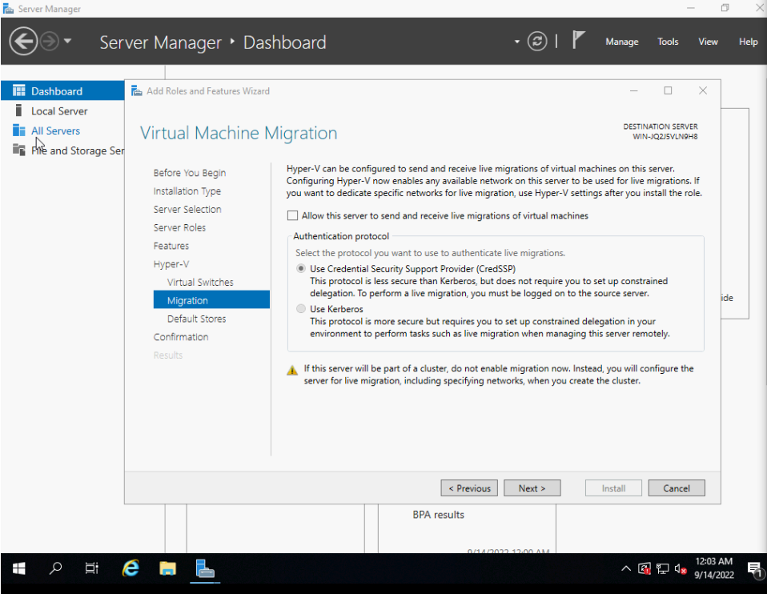

- Chọn vị trí cài đặt máy ảo -> ```Next```

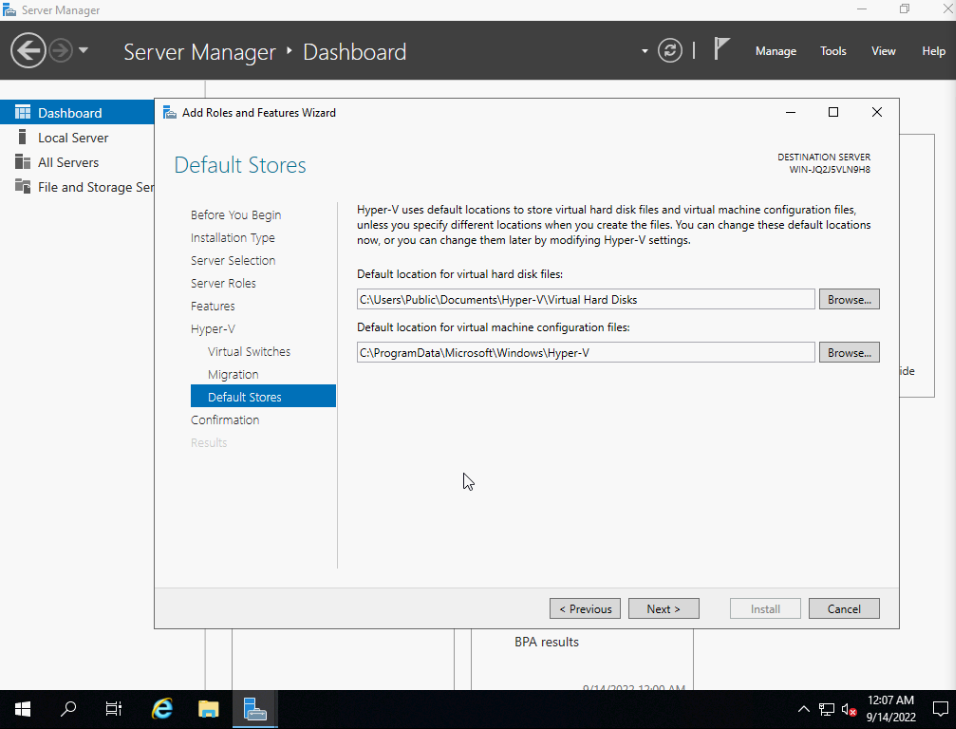

- Nhấn ```Install``` để bắt đầu cài đặt

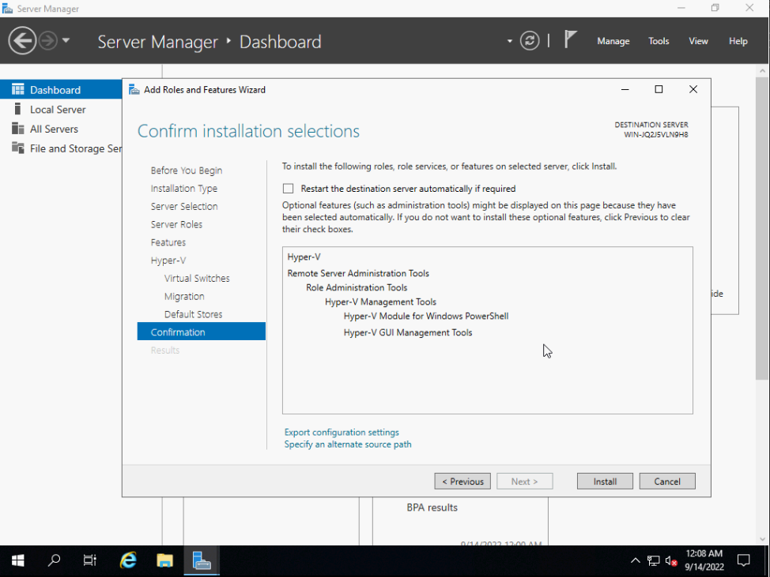

- Sau khi cài đặt xong thì reboot lại sv để hoàn tất

### Tạo máy ảo

- ```Tools``` -> ```Hyper-V Manager```

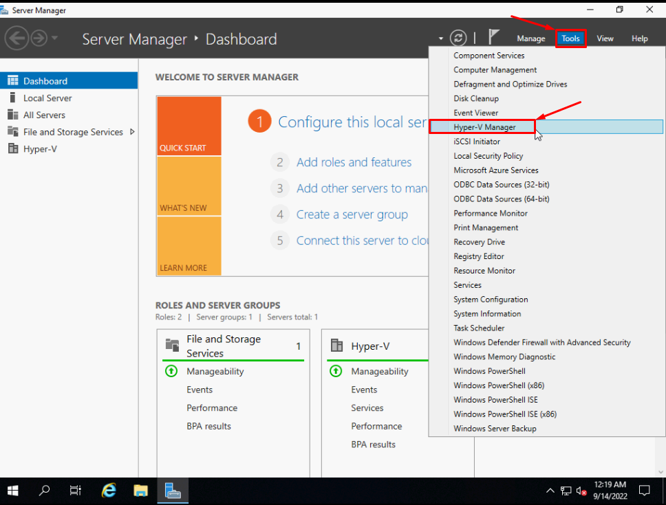

- Chuột phải vào Hostname muốn cài máy ảo -> ```New``` -> ```Virtual Machine```

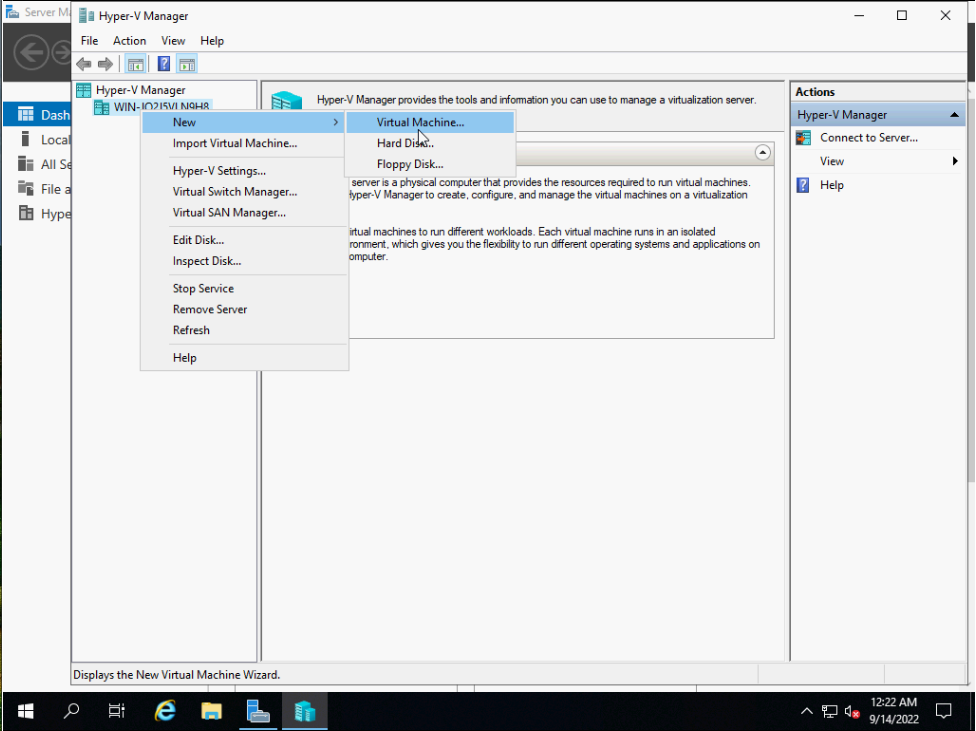

- ```Next```

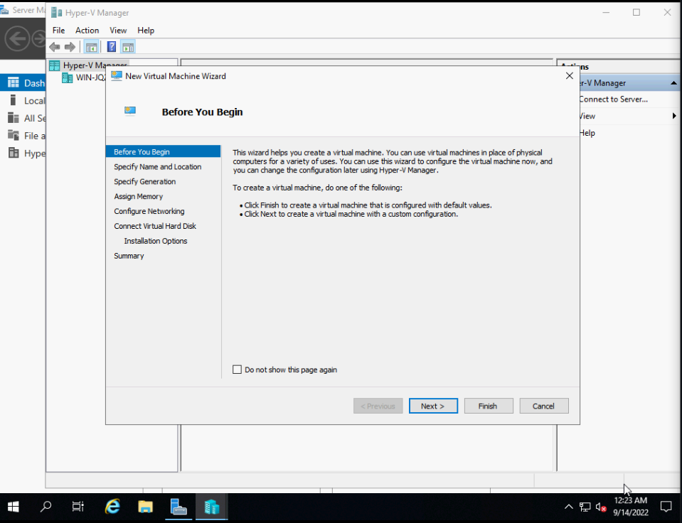

- Đặt tên cho máy ảo -> ```Next```


- Chọn ```Generation 2```


- Cấu hình ổ đĩa ảo cho VM


- Cài đặt hđh cho máy ảo, hoặc để sau

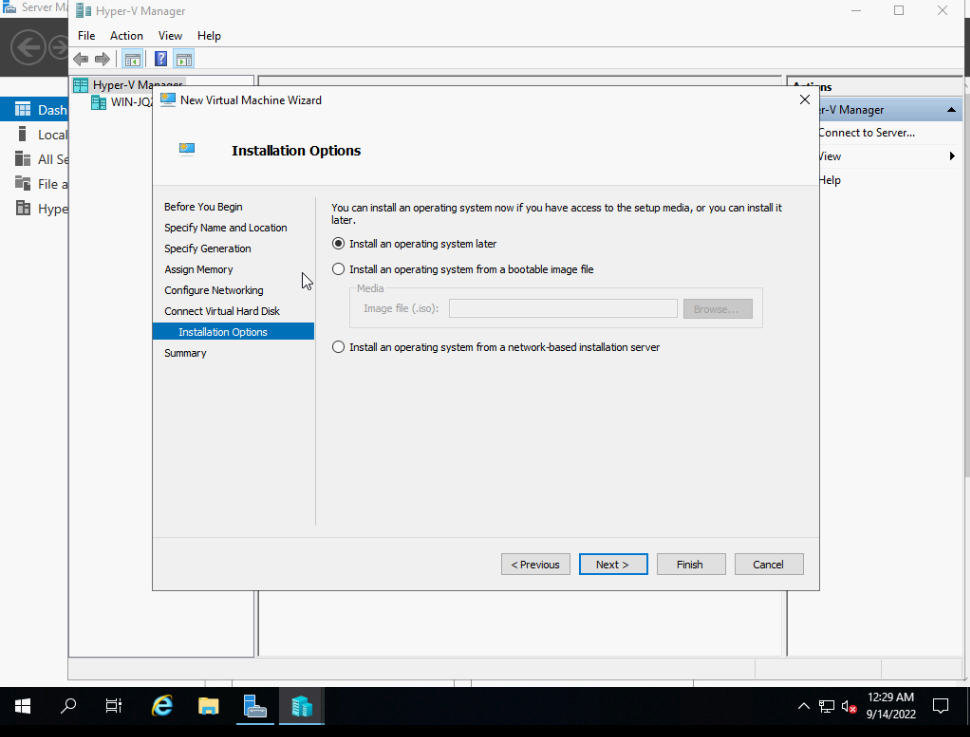

- ```Finish```


- Khi mới tạo, máy sẽ ở trạng thái Off, chuột phải vào và chọn ```Start``` để khởi động máy ảo


- Để truy cập bảng điều khiển, chuột phải vào và chọn ```Connect```

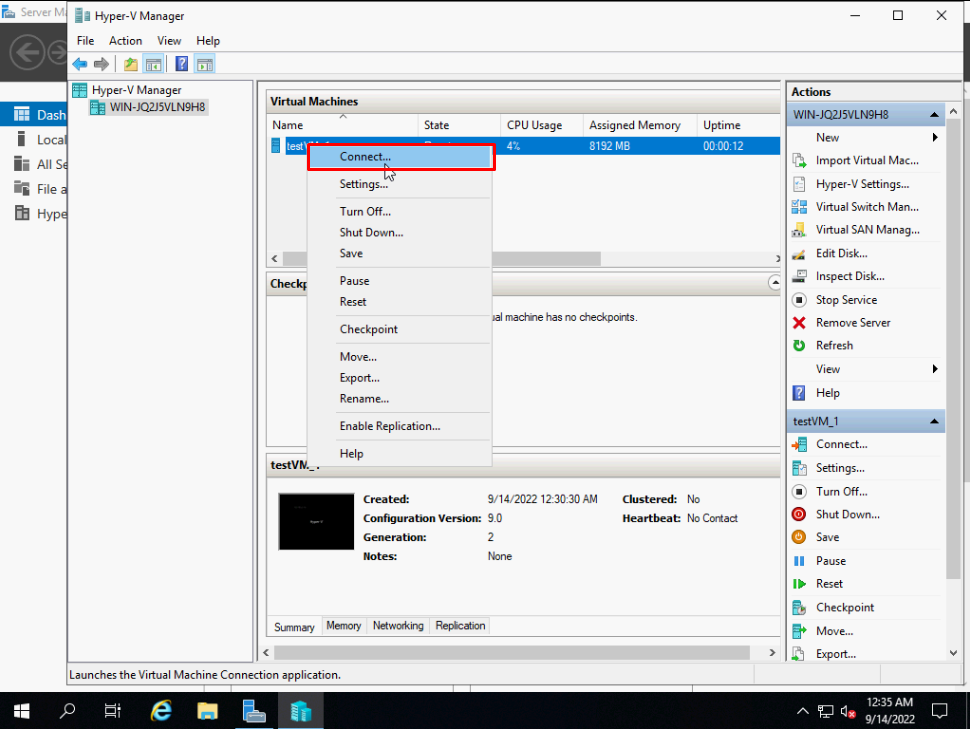

