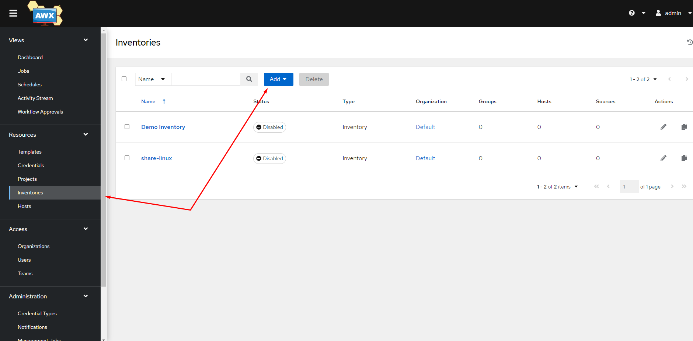
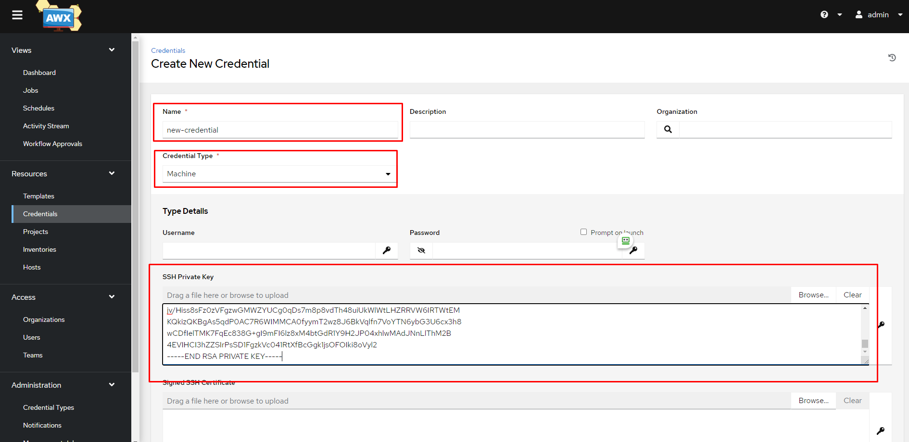
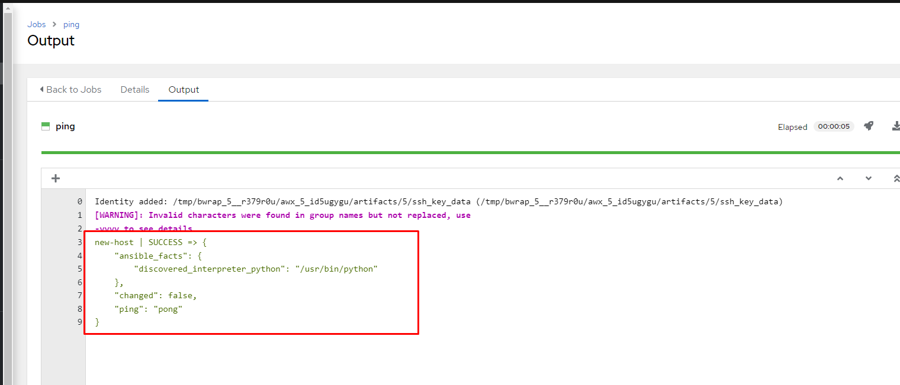

# Sử dụng AWX cơ bản

## I. Khởi tạo Inventory

**Bước 1:** Vào mục ```Inventory```, chọn ```Add```:



**Bước 2:** Điền các thông tin cần thiết. Về cơ bản thì ta chỉ cần điền ```Name``` là đủ:


**Bước 3:** Tạo group mới, ta cũng chỉ cần nhập tên là đủ rồi:


**Bước 4:** Tạo host. Ở đây, ngoài tên của host, ta cần khai báo thêm 2 biến là ```ansible_host``` và ```ansible_port``` lần lượt là IP và port SSH của host


## II. Khởi tạo Credentials

Credentials là nơi lưu trữ các thông tin bảo mật của AWX. Cụ thể trong bài này ta tạo Credential là private key để SSH đến các host.

**Bước 1:** Tạo Credential mới


**Bước 2:** Khai báo tên cho Credential. Do chúng ta tạo Credential là private key để SSH đến host, nên chọn ```Type``` là ```Machine```, sau đó ta paste key (thường đặt tại ```/root/.ssh/id_rsa```) vào phần ```SSH Private Key```



## III. Kiểm tra kết nối

Sau khi đã tạo inventory, host, credential, ta hãy thử kết nối tới host (hãy chắc chắn rằng public_key đã được đưa vào host client)

**Bước 1:** Truy cập vào danh sách các ```Groups``` rồi chọn ```Run Command```. Khi thao tác ```Run Command``` sẽ giống như việc ta sử dụng ```Adhoc Commands```


Chọn ```Module``` sẽ sử dụng rồi chọn ```Next```


Chọn ```Credential``` rồi ```Lauch``` thôi

[](./images/ansible_AWX_17.png)



Như vậy là ta đã kết nối thành công với host client.

