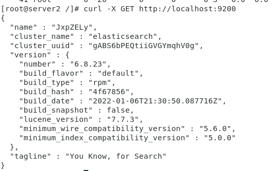
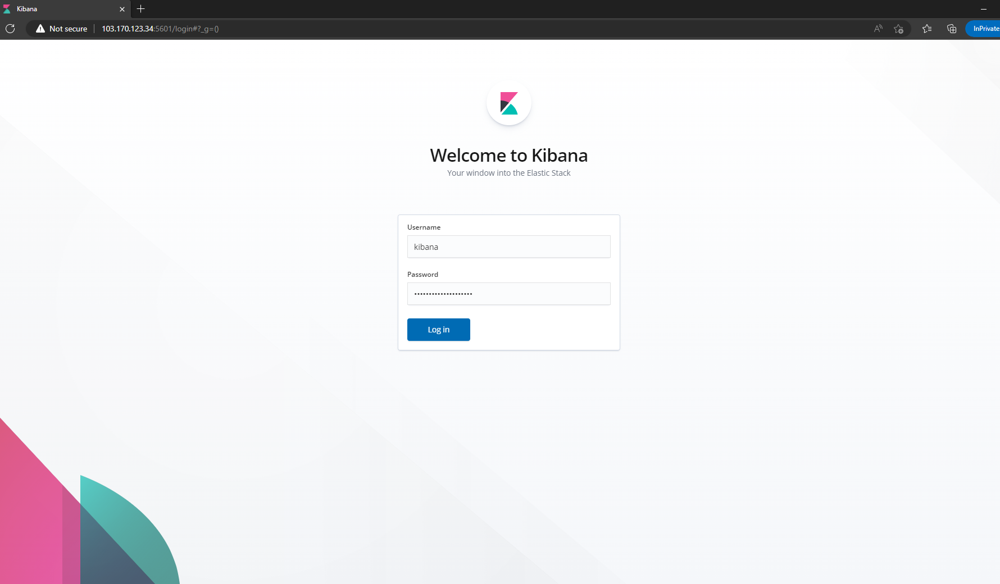

# Cài đặt ELK trên hđh CentOS 7

### 1. Yêu cầu hệ thống

- 1 máy CentOS 7 làm ELK server: RAM 6 GB, 100 GB HDD
- Các máy client có OS là windows, ubuntu hoặc CentOS

### 2. Phân hoạch địa chỉ IP

- ELK server: 10.10.10.190/24, gateway: 10.10.10.1, dns: 8.8.8.8
- Client Ubuntu: 10.10.10.91/24, gateway: 10.10.10.1, dns: 8.8.8.8
- Client CentOS: 10.10.10.92/24, gateway: 10.10.10.1, dns: 8.8.8.8

### 3. Cài đặt trên máy chủ ELK

**Cài đặt JDK**

Trước khi bắt đầu cài đặt ELK Stack, chúng ta cần cài đặt JDK trước.

- Cài đặt JDK 8

```sh
sudo yum install java-1.8.0-openjdk-devel
```

*Note: Nếu có nhiều version java khác nhau, bạn có thể thay đổi giữa chúng bằng lệnh ```sudo alternatives --config java```*

- Thiết lập biến môi trường JAVA_HOME: thiết lập JAVA_HOME giúp các ứng dụng khác được viết trên ngôn ngữ này có thể truy nhập đường dẫn cài đặt Java dễ dàng hơn

- Đầu tiên xác định vị trí cài đặt java: ```sudo update-alternatives --config java```


- Ta có thể thấy đường dẫn cài đặt Java như ở trên là ```/usr/lib/jvm/java-1.8.0-openjdk-1.8.0.362.b08-1.el7_9.x86_64/jre/bin/java```

- Sau đó mở file ```.bash_profile``` và thêm dòng sau vào

```sh
vi ~/.bash_profile
# Thêm dòng sau vào
JAVA_HOME="/usr/lib/jvm/java-1.8.0-openjdk-1.8.0.362.b08-1.el7_9.x86_64/jre/bin/java"
```

**Cài đặt Elasticsearch**

- Import key elastic

```sh
rpm --import http://packages.elastic.co/GPG-KEY-elasticsearch
```

- Thêm repo elastics

```sh
cat << EOF > /etc/yum.repos.d/elasticsearch.repo
[elasticsearch-6.x]
name=Elasticsearch repository for 6.x packages
baseurl=https://artifacts.elastic.co/packages/6.x/yum
gpgcheck=1
gpgkey=https://artifacts.elastic.co/GPG-KEY-elasticsearch
enabled=1
autorefresh=1
type=rpm-md
EOF
```

- Cài đặt Elastic

```sh
yum install elasticsearch -y
```

- Mở file ```/etc/elasticsearch/elasticsearch.yml```

```sh
vi /etc/elasticsearch/elasticsearch.yml
```

- Tìm đến dòng ```network.host``` và sửa lại thành cũng như thêm 1 vài dòng

```sh
network.host: 10.10.10.190
xpack.security.enabled: true
discovery.type: single-node
```

- Khởi động lại Elasticsearch và cho phép dịch vụ khởi động cùng hệ thống 

```sh
systemctl restart elasticsearch
systemctl enable elasticsearch
```

- Tiếp đến, ta sẽ thiết lập authentication token cho elasticsearch:

```sh
/usr/share/elasticsearch/bin/elasticsearch-setup-passwords auto
```

**Hãy lưu lại các thông tin về user và password sau đó**

- Kiểm tra dịch vụ Elasticsearch (chỉ hoạt động nếu không kích hoạt authentication)

```sh
curl -X GET http://localhost:9200
```



*Kết quả trả về như trên là ok*

**Cài đặt Logstash**

- Thêm repo Logstash

```sh
cat << EOF > /etc/yum.repos.d/logstash.repo
[logstash-6.x]
name=Elastic repository for 6.x packages
baseurl=https://artifacts.elastic.co/packages/6.x/yum
gpgcheck=1
gpgkey=https://artifacts.elastic.co/GPG-KEY-elasticsearch
enabled=1
autorefresh=1
type=rpm-md
EOF
```

- Cài đặt Logstash

```sh
yum install logstash -y
```

- Cấu hình xác thực

```sh
vi /etc/logstash/logstash.yml
# Thay đổi các nội dung sau theo thông tin đăng nhập khởi tạo trước đó
xpack.monitoring.enabled: true
xpack.monitoring.elasticsearch.username: "logstash_system"
xpack.monitoring.elasticsearch.password: "changeme"
```

- Khởi động và cho phép dịch vụ khởi động cùng hệ thống

```sh
systemctl daemon-reload
systemctl start logstash
systemctl enable logstash
```

**Cài đặt Kibana**

- Tạo repo cài đặt Kibana

```sh
cat << EOF > /etc/yum.repos.d/kibana.repo
[kibana-6.x]
name=Kibana repository for 6.x packages
baseurl=https://artifacts.elastic.co/packages/6.x/yum
gpgcheck=1
gpgkey=https://artifacts.elastic.co/GPG-KEY-elasticsearch
enabled=1
autorefresh=1
type=rpm-md
EOF
```

- Cài đặt Kibana

```sh
yum install kibana -y
sed -i 's/#server.host: "localhost"/server.host: "0.0.0.0"/g' /etc/kibana/kibana.yml
sed -i 's/#elasticsearch.hosts: ["http://localhost:9200"]/elasticsearch.hosts: ["http://10.10.10.190:9200"]/g' /etc/kibana/kibana.yml
```

- Mở file cấu hình kibana và thêm username và password khởi tạo trước đó vào đây

```sh
vi /etc/kibana/kibana.yml
elasticsearch.username: "<username>"
elasticsearch.password: "<password>"
```

- Tạo Kibana keystore

```sh
/usr/share/kibana/bin/kibana-keystore create
```

- Thêm password của user kibana vào Kibana keystore

```sh
/usr/share/kibana/bin/kibana-keystore add elasticsearch.password
```


- Khởi động và cho phép dịch vụ khởi động cùng hệ thống

```sh
systemctl daemon-reload
systemctl start kibana
systemctl enable kibana
```

- Truy cập vào Kibana kiểm tra bằng đường dẫn ```http://ip-elk_server:5601``` (mở port trên firewall nếu cần thiết)



### 4. Cài đặt filebeat trên client Ubuntu để đẩy log về ELK server

- Download phiên bản cài đặt của ```filebeat```

```sh
curl -L -O https://artifacts.elastic.co/downloads/beats/filebeat/filebeat-6.2.4-amd64.deb
```

- Cài đặt ```filebeat```

```sh
dpkg -i filebeat-6.2.4-amd64.deb
```

- Copy file cấu hình ```filebeat``` để backup khi có lỗi trong lúc cấu hình

```sh
cp /etc/filebeat/filebeat.yml /etc/filebeat/filebeat.orig
rm -rf /etc/filebeat/filebeat.yml
touch /etc/filebeat/filebeat.yml
```

- Đẩy các cấu hình sau vào cấu hình của ```filebeat``` (mở port 5044 trên sv nếu cần thiết)

```sh
cat > /etc/filebeat/filebeat.yml << EOF
filebeat:
prospectors:
  paths:
    /var/log/*.log
  encoding: utf-8
  input_type: log
  fields:
    level: debug
  document_type: type
registry_file: /var/lib/filebeat/registry
output:
  logstash:
    hosts: ["10.10.10.190:5044"]
    worker: 2
    bulk_max_size: 2048
  elasticsearch:
    hosts: ["10.10.10.190:9200"]
    username: "elastic"
    password: "<password_here>"
logging:
  to_syslog: false
  to_files: true
files:
  path: /var/log/filebeat
  name: filebeat
  rotateeverybytes: 1048576000 # = 1GB
  keepfiles: 7
selectors: ["*"]
level: info
EOF
```

- Khởi động ```filebeat```

```sh
service filebeat start
```

- Dùng ```tcpdump``` để kiểm tra xem log đã được đẩy về ELK server hay chưa

```sh
tcpdump -i eth0 dst 10.10.10.190
```

### 5. Cài đặt filebeat trên client CentOS để đẩy log về ELK server

- Thêm repo Elastic

```sh
cat > /etc/yum.repos.d/elastic.repo << EOF
[elasticsearch-6.x]
name=Elasticsearch repository for 6.x packages
baseurl=https://artifacts.elastic.co/packages/6.x/yum
gpgcheck=1
gpgkey=https://artifacts.elastic.co/GPG-KEY-elasticsearch
enabled=1
autorefresh=1
type=rpm-md
EOF
```

- Cài đặt ```filebeat```

```sh
yum install filebeat-6.2.4 -y
```

- Copy file cấu hình để backup

```sh
cp /etc/filebeat/filebeat.yml /etc/filebeat/filebeat.yml.orig
rm -rf /etc/filebeat/filebeat.yml
touch /etc/filebeat/filebeat.yml
```

- Thêm vào ```filebeat``` những cấu hình như sau (mở port 5044 trên sv nếu cần thiết)

```sh
cat > /etc/filebeat/filebeat.yml << EOF
filebeat:
prospectors:
  paths:
    /var/log/*.log
  encoding: utf-8
  input_type: log
  fields:
    level: debug
  document_type: type
registry_file: /var/lib/filebeat/registry
output:
  logstash:
    hosts: ["10.10.10.190:5044"]
    worker: 2
    bulk_max_size: 2048
  elasticsearch:
    hosts: ["10.10.10.190:9200"]
    username: "elastic"
    password: "<password_here>"
logging:
  to_syslog: false
  to_files: true
files:
  path: /var/log/filebeat
  name: filebeat
  rotateeverybytes: 1048576000 # = 1GB
  keepfiles: 7
selectors: ["*"]
level: info
EOF
```

- Khởi động ```filebeat```

```sh
systemctl start filebeat
systemctl enable filebeat
```

- Dùng ```tcpdump``` để kiểm tra

```sh
tcpdump -i eth0 dst 10.10.10.190
```

### 6. Sử dụng apache2 module để gửi log access và error về server

- Enable module apache2

```sh
sudo filebeat modules enable apache2
```

- Chạy filebeat setup

```sh
filebeat setup
```

**Lưu ý: Phần output chỉ có thể khai báo logstash HOẶC elasticsearch. Ban đầu chúng ta cần khởi tạo kết nối đến server bằng elasticsearch trước nên ta phải comment phần này lại, sau đó đảo ngược lại**