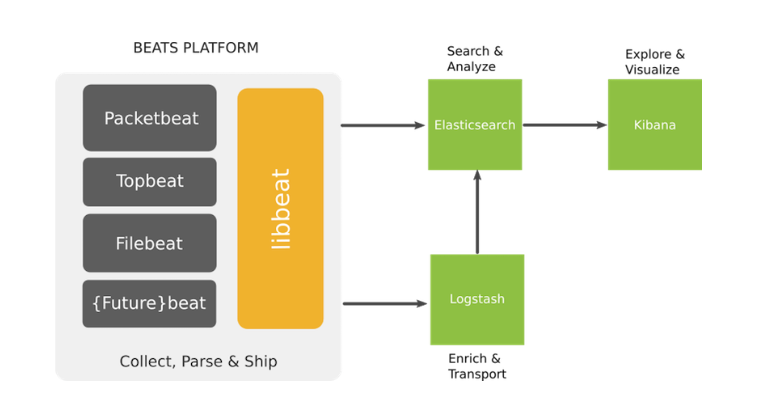
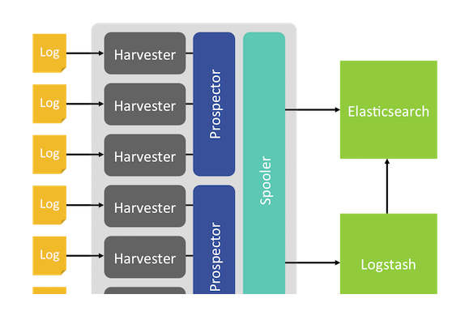
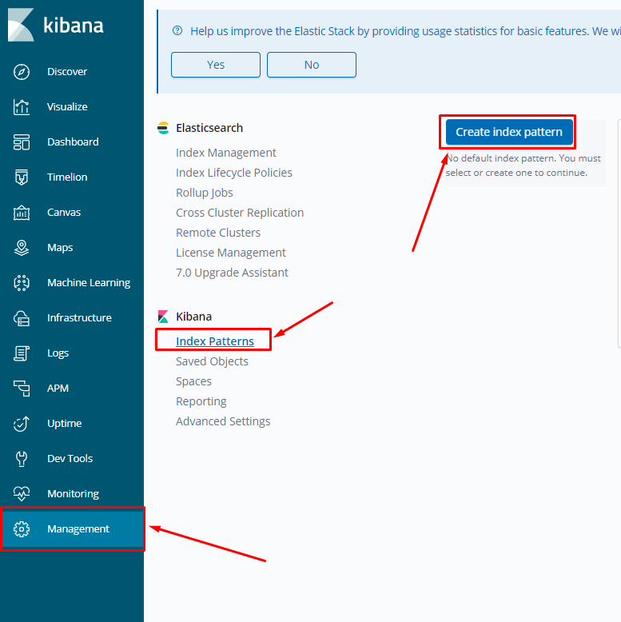

# Tìm hiểu về filebeat

### 1. Giới thiệu chung về Beats

- Beats là những data shipper mã nguồn mở mà ta sẽ cài đặt như các agent trên các server mà chúng ta cần thu thập các sự kiện để gửi các kiểu dữ liệu khác nhau tới Elasticsearch. Beats có thể gửi dữ liệu trực tiếp tới Elasticsearch hay tới Logstash

- Beats là 1 platform trong đó các project nhỏ sinh ra thực hiện trên từng loại dữ liệu nhất định

- ELK cần sử dụng các "beat" để làm shipper giúp gửi các loại dữ liệu từ client tới Server

- Các beat index pattern cần được cài đặt trên cả ELK server và các client. Trên ELK server, các beat sẽ kết hợp với các thành phần để lọc dữ liệu, đánh chỉ mục, hiển thị

- Một số beats pattern thường được dùng là:
    - Packetbeat: thực hiện gửi dữ liệu được capture từ các port về server
    - Topbeat: như là 1 monitor agent, giúp chúng ta có thể thu thập các thông tin về phần cứng như là CPU, RAM
    - Filebeat: giúp vận chuyển các log từ client về server
    - Winlogbeat: giúp vận chuyển event log từ các client là máy OS Windows
    - Metricbeat: thu thập các dữ liệu từ hệ điều hành, các dịch vụ như apache, HAProxy, MongoDB, Nginx,...

- Mô hình beats platform



- Trong các beats pattern được kể ở trên thì filebeat thường được ưu tiên sử dụng, tuy nhiên filebeat vẫn còn 1 số hạn chế cần lưu ý khi sử dụng như:
    - Khó khăn đối với người mới sử dụng cú pháp YAML
    - Nếu cấu hình quá nhiều file log cần đẩy về thì tệp filebeat registry sẽ phình to rất nhanh do cần dung lượng để lưu trữ từng trạng thái của từng dòng log
    - Không nên cấu hình filebeat quét các filelog nhỏ hơn 1s bởi vì điều này sẽ khiến cho filebeat chiếm 1 lượng CPU đáng kể

### 2. Cách thức hoạt động

- Khi khởi động filebeat, nó sẽ khởi chạy 1 hay nhiều prospector, tìm kiếm các đường dẫn của tập tin mà ta đã khai báo. Với mỗi tập tin log mà prospector tìm thấy được, filebeat sẽ khởi chạy 1 harvester. Mỗi 1 harvester đọc 1 tập tin log và gửi các bản tin log này khi có dữ liệu mới tới spooler. Spooler là nơi tổng hợp các sự kiện và dữ liệu đã tổng hợp được tới output mà ta đã cấu hình trên filebeat

- Cấu trúc bên trong filebeat



### 3. Cấu hình filebeat từ client Ubuntu về ELK stack

- Trên client Ubuntu chúng ta thực hiện cài đặt GPG keys từ Elastic và thêm Elastic repo

```sh
rpm --import https://packages.elastic.co/GPG-KEY-elasticsearch

cat > /etc/yum.repos.d/elastic.repo << EOF
[elasticsearch-6.x]
name=Elasticsearch repository for 6.x packages
baseurl=https://artifacts.elastic.co/packages/6.x/yum
gpgcheck=1
gpgkey=https://artifacts.elastic.co/GPG-KEY-elasticsearch
enabled=1
autorefresh=1
type=rpm-md
EOF
```

- Cài đặt filebeat

```sh
yum install filebeat-6.2.4 -y
```

- Enable và start filebeat

```sh
chkconfig --add filebeat
service filebeat start 
```

- Backup file cấu hình của filebeat

```sh
cp /etc/filebeat/filebeat.yml /etc/filebeat/filebeat.yml.orig
rm -rf /etc/filebeat/filebeat.yml
touch /etc/filebeat/filebeat.yml
```

- Tạo thư mục lưu trữ debug từ filebeat

```sh
mkdir /var/log/filebeat
```

- Thêm vào ```/etc/filebeat/filebeat.yml``` cấu hình như sau

```sh
filebeat:
prospectors:
    -
    paths:
        - /var/log/*.log
    encoding: utf-8
    input_type: log
    fields:
        level: debug
    document_type: syslog
registry_file: /var/lib/filebeat/registry
output:
logstash:
# Thông số hosts => là địa chỉ máy chủ ELK
    hosts: ["IP-ELK:5044"]
    worker: 1
    bulk_max_size: 2048
logging:
to_syslog: false
to_files: true
files:
    path: /var/log/filebeat
    name: filebeat
    rotateeverybytes: 1048576000 # = 1GB
    keepfiles: 7
selectors: ["*"]
level: info
```

### 4. Cấu hình filebeat từ client CentOS về ELK stack

- Trên client CentOS thực hiện thêm repo Elastic

```sh
cat > /etc/yum.repos.d/elastic.repo << EOF
[elasticsearch-6.x]
name=Elasticsearch repository for 6.x packages
baseurl=https://artifacts.elastic.co/packages/6.x/yum
gpgcheck=1
gpgkey=https://artifacts.elastic.co/GPG-KEY-elasticsearch
enabled=1
autorefresh=1
type=rpm-md
EOF
```

- Cài đặt filebeat

```sh
yum install filebeat-6.2.4 -y
```

- Backup file cấu hình của filebeat

```sh
cp /etc/filebeat/filebeat.yml /etc/filebeat/filebeat.yml.orig
rm -rf /etc/filebeat/filebeat.yml
touch /etc/filebeat/filebeat.yml
```

- Thêm vào ```/etc/filebeat/filebeat.yml``` cấu hình như sau

```sh
cat > /etc/filebeat/filebeat.yml << EOF
filebeat:
prospectors:
    - paths:
        - /var/log/*.log
    encoding: utf-8
    input_type: log
    fields:
        level: debug
    document_type: type
registry_file: /var/lib/filebeat/registry
output:
logstash:
# Ip của máy chủ ELK
    hosts: ["IP-ELK:5044"]
    worker: 2
    bulk_max_size: 2048
logging:
to_syslog: false
to_files: true
files:
    path: /var/log/filebeat
    name: filebeat
    rotateeverybytes: 1048576000 # = 1GB
    keepfiles: 7
selectors: ["*"]
level: info
EOF
```

- Khởi động lại filebeat

```sh
systemctl start filebeat
systemctl enable filebeat
```

### 5. Cấu hình logstash

- Tạo file config của logtash để thiết lập input và output

```sh
touch /etc/logstash/conf.d/02-logstash.conf
```

- Thêm vào file cấu hình ```etc/logstash/conf.d/02-logstash.conf``` nội dung sau

```sh
input {
beats {
    port => 5044
    ssl => false
}
}

output {
    elasticsearch {
    hosts => ["localhost:9200"]
    sniffing => true
    index => "%{[@metadata][beat]}-%{+YYYY.MM.dd}"
    }
}
```

- Sau đó restart lại logstash

```sh
systemctl stop logstash
systemctl start logstash
```

### 6. Tạo Index trên Kibana để theo dõi các sự kiện được đẩy về

- Truy cập vào kibana với port 5601 theo đường dẫn

```sh
IP-ELK:5601
```

- Vào mục ```Management``` -> ```Index Pattern``` -> ```Create Index```



