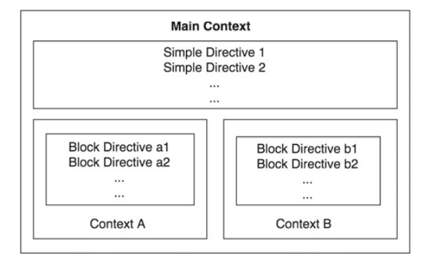

# Tìm hiểu về tệp cấu hình của Nginx

## Cấu trúc và cách sử dụng tệp cấu hình

- Tất cả file cấu hình của nginx đều nằm trong thư mục ```/etc/nginx/```
- File cấu hình chính của nginx là ```/etc/nginx/nginx.conf```
- Document root directory ```/usr/share/nginx/html```
- Nginx bao gồm các module được điều khiển bởi các directive trong file cấu hình. "Directive" được định nghĩa như 1 instruction (chỉ dẫn) hay direct. Directives được chia thành các directive đơn giản và các block directive
    - Cấu trúc của 1 directive đơn giản gồm tên và tham số được phân tách bởi dấu cách và kết thúc bằng dấu chấm phẩy. VD ```worker_processes 1;```
    - 1 block directive có cấu trúc tương tự như 1 directive đơn giản nhưng thay vì sử dụng dấu ```;``` nó sẽ sử dụng cặp dấu ```{}``` để bắt đầu và kết thúc 1 block directive. 1 config file điển hình của nginx có thể được minh họa như hình dưới



- Một main context sẽ bao gồm nhiều directive đơn giản, nhiều context (VD: context A, context B) chứa các block directive

## Cách sử dụng config file hợp lí và hiệu quả

- Tạo 1 file cấu hình riêng cho mỗi tên miền sẽ giúp server dễ quản lý và hiệu quả hơn
- Nginx không có virtual host, thay vào đó là ```Server Blocks``` sử dụng ```server_name``` và nghe các chỉ thị để liên kết với các tcp sockets. Tất cả các file server block phải có định dạng là ```.conf``` và được lưu trong thư mục ```/etc/nginx/conf.d``` hoặc ```etc/nginx/conf```
- Nếu bạn có 1 domain là ```mydomain.com``` thì bạn nên đặt tên file cấu hình là ```mydomain.com.conf```
- Nếu bạn sử dụng các phân đoạn cấu hình có thể lặp lại trong các khối máy chủ tên miền của mình, bạn nên cấu trúc lại các phân đoạn đó thành các đoạn
- Các file nhật ký nginx (access.log và error.log) được đặt trong thư mục ```/var/log/nginx/```. Nếu có 1 tệp nhật ký access và error khác nhau cho mỗi server block
- Bạn có thể đặt document root directory của tên miền của bạn đến bất kỳ vị trí nào bạn muốn. 1 số vị trí thường được dùng cho webroot bao gồm:
    - /home/<user_name>/<site_name>
    - /var/www/<site_name>
    - /var/www/html/<site_name>
    - /opt/<site_name>
    - /usr/share/nginx/html

## Các thao tác cần thực hiện trước và sau khi chỉnh sửa config file

- Trước khi thay đổi cấu hình, sao lưu lại file cấu hình

```sh
cp /etc/nginx/conf/nginx.conf /etc/nginx/conf/nginx.conf.backup
```

- Định kỳ sao lưu tập tin cấu hình nginx

```sh
cp /etc/nginx/conf/nginx.conf /etc/nginx/conf/nginx.conf.$(date "+%b_%d_%Y_%H.%M.%S")
```

- Sau khi thực hiện thay đổi cấu hình trong file cấu hình, restart lại service 

```sh
systemctl restart nginx
```

**Chú ý:**
- Tất cả những dòng có dấu "#" phía trước là những dòng chú thích (comment) được sử dụng để giải thích những khối lệnh dùng làm gì hoặc để lại ý kiến làm thế nào chỉnh sửa giá trị
- Ngoài ra, bạn cũng có thể thêm riêng những comment theo ý của mình. Bạn có thể cho đoạn mã đó được kích hoạt bằng cách loại bỏ các ```#```
- Cài đặt bắt đầu với những tên biến và sau đó 1 đối hay một loạt các đối số cách nhau bởi dấu cách
- Một số thiết lập được đặt trong 1 cặp dấu ngoặc nhọn ({}). Các dấu ngoặc nhọn có thể được lồng vào nhau cho nhiều khối lệnh, cần nhớ là khi đã mở ngoặc nhọn thì phải đóng nó lại không thì nginx sẽ không thể chạy được
- Sử dụng tab hay space để phân cấp đoạn mã sẽ giúp dễ dàng chỉnh sửa hay tìm ra lỗi

## Tìm hiểu chi tiết về config file

**Core Contexts**

Đây là nhóm đầu tiên của contexts, được nginx sử dụng để tạo ra 1 cây phân cấp và tách biệt các cấu hình giữa các block. Trong đây cũng bao gồm các cấu hình chính của nginx

**Main Context**

Cũng có thể coi là global context. Đây là context chung nhất bao gồm tất cả các directive đơn giản, block directive và các context khác

1 config file của nginx sẽ trông như thế lày:

```sh
#user   nobody;
worker_processes    1;

#error_log  logs/error.log;
#error_log  logs/error.log  notice;
#error_log  logs/error.log  info;

#pid        logs/nginx.pid;

events {
    worker_connections  1024;
}

http {
    include         mime.types;
    default_type    application/octet-stream;
    
    #log_format main    '$remote_addr - $remote_user [$time_local] "$request"'
    #                   '$status $body_bytes_sent "$http_referer"'
    #                   '"$http_user_agent" "$http_x_forwarded_for"';

    #access_log logs/access.log main;

    sendfile    on;
    #tcp_nopush on;

    #keepalive_timeout  0;
    keepalive_timeout   65;

    #gzip   on;

    server {
        listen      80;
        server_name localhost;

        #charset    koi8-r;

        #access_log logs/host.access.log    main

        location / {
            root    html;
            index   index.html  index.htm;
        }

        #error_page 404     /404.html;

        # redirect server error pages to the static page /50x.html
        #
        error_page  500 502 503 504 /50x.html;
        location = /50x.html {
            root    html;
        }

        # proxy the PHP scripts to Apache listening on 127.0.0.1:80
        #
        # location ~ \.php$ {
        #    proxy_pass http://127.0.0.1;
        #}

        # pass the PHP scripts to FastCGI server listening on 127.0.0.1:9000
        #
        # location ~ \.php$ {
        #    proxy_pass http://127.0.0.1;
        #}

        # pass the PHP scripts to FastCGI server listening on 127.0.0.1:9000
        #
        # location ~ \.php$ {
        #    root            html;
        #    fastcgi_pass    127.0.0.1:9000;
        #    fastcgi_index   index.php;
        #    fast_param      SCRIPT_FILENAME     /scripts$fastcgi_script_name;
        #    include         fastcgi_params;
        #}

        # deny access to .htaccess files, if Apache's document root
        # concurs with nginx's
    }
}