# Các thao tác cơ bản với aaPanel

### 1. Đăng nhập

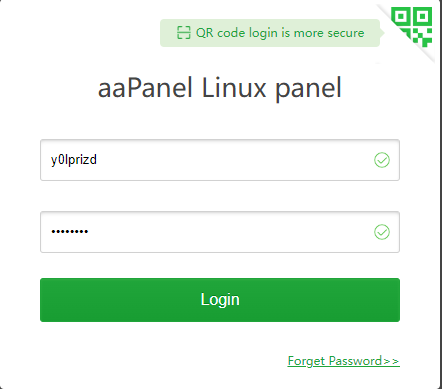

**Lưu ý:** Thông tin đăng nhập được lấy sau khi cài đặt thành công

### 2. Cài đặt LAMP/LEMP

- Vào lần đầu đăng nhập vào trang quản trị của aaPanel, ta sẽ được gợi ý cài đặt ```LAMP``` hoặc ```LEMP```, chọn 1 trong 2, chọn kiểu cài đặt ```Fast``` hoặc ```Conpiled``` và nhấn ```One-click``` để tiến hành cài đặt


### 3. Main menu

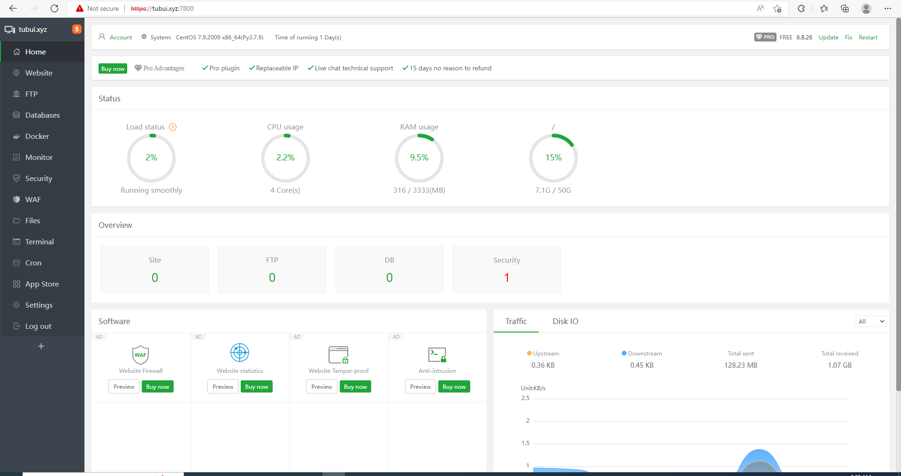

- ```Status```: hiển thị thông tin trạng thái tài nguyên của hệ thống

- ```Overview```: hiển thị các thông báo đáng chú ý của các dịch vụ đang chạy, có thể click vào từng con số để xem thông báo chi tiết

- ```Software```: hiển thị trạng thái các phần mềm đã hoặc có thể được cài đặt

- ```Trafffic```: giúp theo dõi, giám sát lưu lượng mạng của server

- ```Disk IO```: giúp giám sát hoạt động của ổ đĩa

### 4. Website

#### Tạo trang web

- Trong phần ```Website```, chọn ```Add site```


- Nhập thông tin về site ta muốn tạo, đồng thời có thể tạo luôn FTP và database cho site đó, những tùy chọn khác, để sau thay đổi cũng không muộn

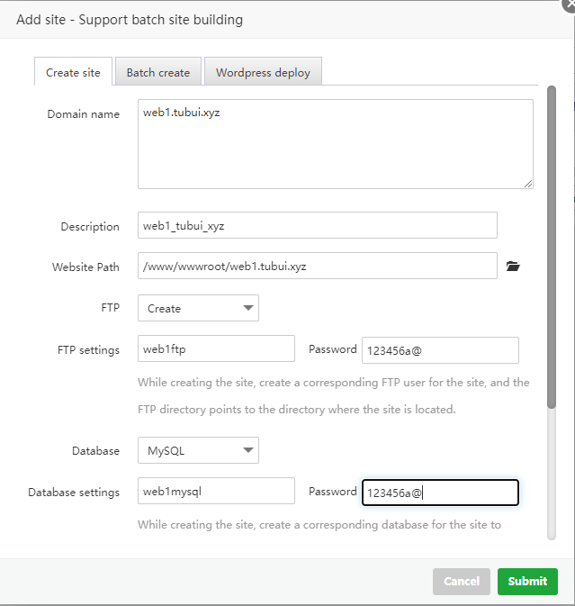

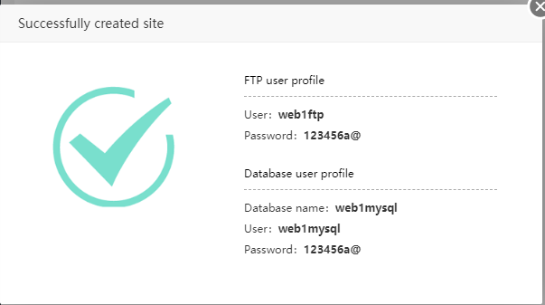

#### Chỉnh sửa nội dung trang web

- ```Website``` -> Ở site vừa tạo, nhấn vào đường dẫn ```Document Root```

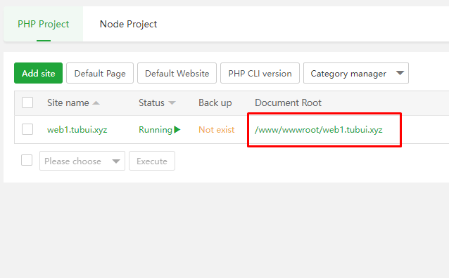

- Sửa nội dung file ```index.html```

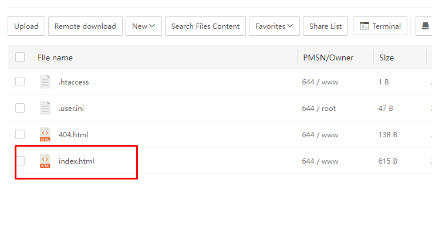

- Vào site để kiểm tra

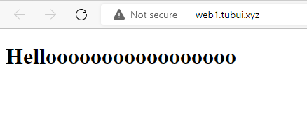

#### Cài đặt chứng chỉ SSL Let's encrypt

- Vào phần chỉnh sửa site mà ta muốn cài đặt SSL, chọn ```SSL``` -> ```Select All``` trong mục Domain name -> ```Apply```

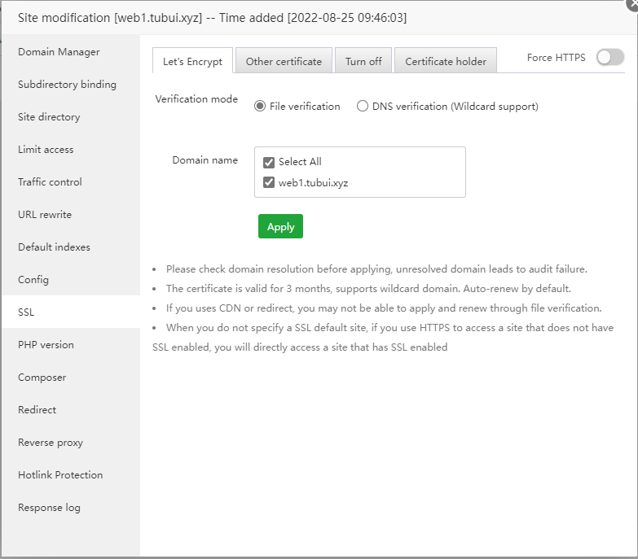

- Cài đặt thành công


- Kiểm tra

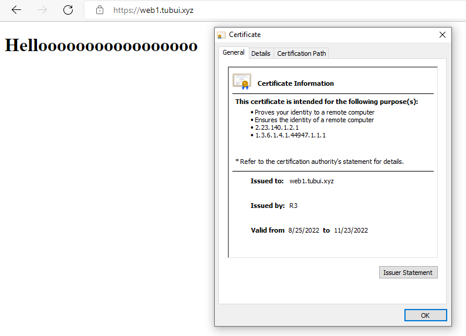


### 5. FTP

- FTP sử dụng để truy nhập file từ xa, có thể dùng để upload source code của mỗi trang web với user tương ứng
- Để truy cập vào trang quản lý, chọn tab ```FTP```
- Tại đây ta có thể sửa đường dẫn, thay đổi mật khẩu, xóa tài khoản FTP, ngoài ra cũng có thể đổi cổng kết nối FTP bằng ```Change FTP port```
- Có thể truy cập FTP từ xa bằng cách nhập ```ftp://tubui.xyz:21``` lên FTP client như File Explorer


- Nhập tên tài khoản FTP của web1 đã tạo từ trước

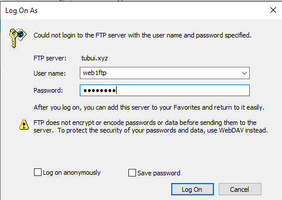

- Đăng nhập thành công


- Tại đây ta có thể copy/paste, thêm/sửa/xóa file của site ```web1.tubui.xyz```

### 6. Databases

- Mỗi CSDL đều có thể: backup/restore, truy xuất và thay đổi dữ liệu (thông qua phpMyAdmin), cấp quyền truy cập CSDL cho người khác, thay đổi mật khẩu và xóa CSDL

### 7. Files

- ```Files``` trên server có thể được quản lý ngay trên giao diện web của aaPanel
- Các tính năng chính:
    - Upload file lên server đơn giản bằng thao tác kéo thả
    - Remote download: tải file từ 1 trang web khác và lưu vào server
    - Quản lý file trong server: thêm/sửa/xóa file hoặc đường dẫn (softlink/shortcut)
    - Search Files Content: tìm kiếm file theo tên hoặc theo biểu thức chính quy
    - Recycle Bin: nơi chứa file/thư mục đã xóa, tại đây ta có thể khôi phục hoặc xóa vĩnh viễn file/thư mục

### 8. Terminal

- Dùng để ssh vào server

### 9. Cron job

- Cron job là phần mềm xử lý các tác vụ lặp đi lặp lại theo 1 điều kiện thời gian nhất định
- Để quản lý Cron job, vào tab ```Cron```
- Tại đây ta có thể tạo: Shell Script, Backup Site, Backup Database, Cut Log, Backup Directory, Free RAM, Access URL

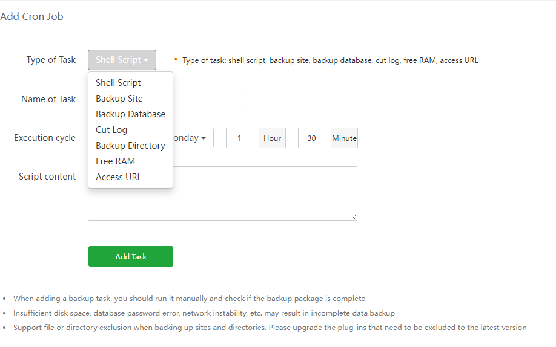


- Với mỗi Cron job ta cũng có thể: thực thi, sửa, xem log hoặc xóa nó đi

### 10. Security

- Tab này cho phép ta mở/đóng port, block IP, thay đổi port dành cho SSH cũng như đọc được log thực thi trên panel

### 11. Giao diện CLI

- aaPanel có thể được quản lý dưới dạng giao diện dòng lệnh với các lệnh quản trị cho hệ thống Panel 


- (1) Khởi động lại panel
- (2) Dừng panel
- (3) Khởi động panel
- (4) Tải lại panel
- (5) Đổi mật khẩu panel
- (6) Đổi tên tài khoản panel
- (7) Buộc thay đổi mật khẩu root của MySQL
- (8) Đổi cổng panel
- (9) Xóa cache của panel
- (10) Xóa giới hạn đăng nhập
- (11) Hủy giới hạn truy cập
- (12) Hủy giới hạn kết nối tên miền
- (13) Hủy giới hạn truy nhập IP
- (14) Xem thông tin mặc định của panel
- (15) Xóa rác hệ thống
- (16) Sửa panel (kiểm tra lỗi và cập nhật tệp tin panel tới phiên bản mới nhất)
- (17) Thiết lập bật/tắt nén khi cắt log
- (18) Thiết lập khi nào thì tự động backup panel
- (22) Hiển thị error log của panel
- (23) Tắt xác thực BasicAuth
- (24) Tắt xác thực của Google
- (25) Thiết lập thời điểm lưu lịch sử sao chép của tập tin
- (26) Giữ/Xóa bản sao lưu cục bộ khi sao lưu đến kho lưu trữ đám mây (cloud storage)
- (0) Thoát

### 11. App Store

- App Store bao gồm danh sách các ứng dụng đã cài và có thể cài lên server

### 12. Settings

- Cho phép ta thay đổi nhiều thiết lập của panel như port vào trang quản trị, tài khoản quản trị, entrance, đường dẫn lưu site,...

### 13. Thử cài đặt 1 trang wordpress

- Vào ```App Store``` tải về plug-in ```one-click deployment```


- Nhấn vào plug-in ```one-click deployment``` ở dashboard, chọn ```Wordpress```

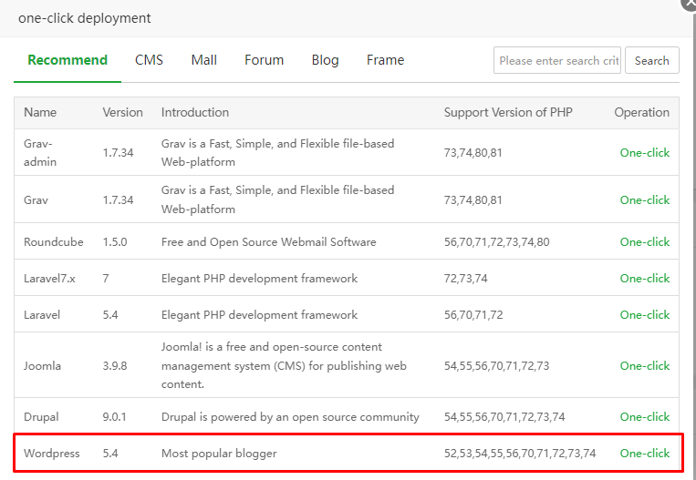

- Nhập thông tin cho trang Wordpress

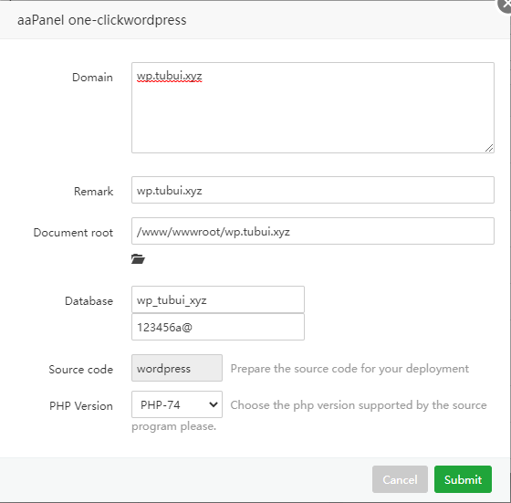

