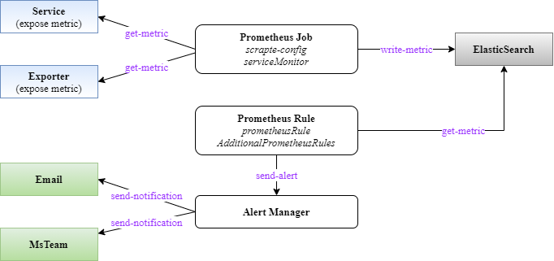

# Alert Manager

Tiếp tục về monitoring, trong bài viết này sẽ giới thiệu về cách sử dụng Alert Manager trong Grafana-Prometheus stack

## Giới thiệu

Mục tiêu trong bài viết này:
- Tìm hiểu cách cấu hình rule cho service
- Tìm hiểu cách sử dụng Prometheus rule để cấu hình rule cho service
- Tìm hiểu cách cấu hình Alert Manager để gửi cảnh báo
- Cách troubleshoot vấn đề phát sinh trong khi cấu hình

Hãy xem lại về luồng hoạt động của Prometheus stack:



Trong đó:
- Prometheus lấy thông tin metric từ các đối tượng cần giám sát và lưu vào database của nó (một database dạng Time Series)
- Prometheus đọc các rule (là các hàm so sánh giá trị metric với các ngưỡng xác định) để đẩy về Alert Manager. Có 2 cách để cấu hình rule cho Prometheus trong bộ kube-prometheus-stack này, đều bằng cách tùy biến file helm value của stack:
   - Cách 1: Cấu hình trực tiếp vào tham số ```additionalPrometheusRules```, ví dụ:

```sh
additionalPrometheusRules:
- name: my-rule-file
groups:
  - name: my_group
    rules:
    - record: my_record
      expr: 100 * my_record
```

   - Sử dụng đối tượng PrometheusRule để khai báo rule cho service. Để làm được việc này thì ta cần cấu hình tham số ```ruleNamespaceSelector``` và ```ruleSelector``` để chỉ định cách Prometheus đọc các PrometheusRule của K8s
- Alert Manager sẽ có config riêng của nó để thực hiện phân luồng cảnh báo tới các người nhận khác nhau, việc này gọi là route. Thông tin người nhận (gọi là receiver) được cấu hình ở Alert Manager, hỗ trợ khá đa dạng từ email, slack, mstream, telegram,...

## Cấu hình rule trực tiếp vào helm value

Là cách 1 đề cập bên trên, ta có thể cấu hình trực tiếp các rule và trong cấu hình ```additionalPrometheusRules```

Cách này có 1 số vấn đề:
- Khi số lượng rule lớn, file helm value sẽ trở nên rất lớn, cồng kềnh và khó quản lý
- Mỗi khi cần tạo thêm file lại phải update lại file helm value và upgrade lại stack, tốn rất nhiều thời gian
- Khó troubleshoot khi cấu hình bị sai lỗi cú pháp

## Cấu hình rule bằng cách sử dụng Prometheus Rule

Cách sử dụng của PrometheusRule giống với serviceMonitor, có thể mô tả như sau:
- Ta sẽ cấu hình Prometheus đọc các PrometheusRule ở các namespace nhất định mà khớp với các label nhất định
- Với mỗi service cần khai báo rule, ta sẽ tạo 1 file PrometheusRule dạng yaml, trong đó có 2 phần quan trọng:
   - Label gán cho đối tượng Prometheus này phải match với cấu hình ruleSelector đã cấu hình ban đầu để đảm bảo nó được tạo ra thì sẽ tự động load vào cấu hình rule của Prometheus
   - Các cấu hình rule cảnh báo của service (là các biểu thức so sánh các metric với các tham số ngưỡng để sinh cảnh báo)

Như vậy cách làm này sẽ giải quyết triệt để được các vấn đề bên trên. Lúc này ta sẽ quản lý các file yaml là các bộ rule cho các service, khi cần update thì áp dụng file yaml này là được. Và hoàn toàn có thể tái sử dụng các rule này cho cùng service khi triển khai cho các dự án khác.

## Cấu hình ruleSelector cho Prometheus

Về lý thuyết cần cấu hình 2 tham số:
- **ruleNamespaceSelector:** để chỉ định sẽ đọc các PrometheusRule ở những ns nào. Mặc định là tất cả ns
- **ruleSelector:** là cấu hình cách filter các đối tượng PrometheusRule sẽ được load vào Prometheus. Ở đây dùng cách filter theo label và đọc tất cả các PrometheusRule có gán label gồm cặp key là **app** cùng value **kube-prometheus-stack** hoặc **prometheus-rule**

Giải thích thêm một chút ở đây là khi cài bộ **kube-prometheus-stack** thì đi kèm với nó đã có các rule mặc định và gán label **app=kube-prometheus-stack**, còn label **app=prometheus-rule** là ta gán vào để lab

Giờ cấu hình tham số trong file helm value:

```sh
ruleNamespaceSelector: {}

ruleSelector:
  matchExpressions:
  - key: app
    operator: In
    values:
    - prometheus-rule
    - kube-prometheus-stack
```

Sau đó upgrade release bằng lệnh helm

```sh
helm -n monitoring upgrade prometheus-stack -f values-prometheus-clusterIP.yaml kube-prometheus-stack
```

Sau bước này thì Prometheus sẽ hiểu là nó sẽ đọc tất cả các đối tượng PrometheusRule ở tất cả các namespace mà có gán một trong các label là ```app=kube-prometheus-stack``` hoặc ```app=prometheus-rule```

