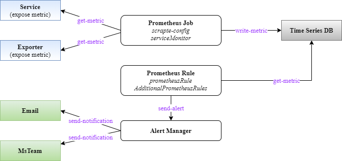

# Service Monitor

Trong phần trước ta đã tìm hiểu về cách cài đặt và sử dụng Grafana - Prometheus - Alert Manager stack trên K8s. Vậy bây giờ hãy đi sâu vào:
- Cách cấu hình lấy metric một ứng dụng bằng cấu hình job trong scrapeConfig
- Cách cấu hình lấy metric một ứng dụng bằng Service Monitor
- Cách cài một ứng dụng hỗ trợ sẵn metric và serviceMonitor
- Cách troubleshoot các vấn đề phát sinh khi cấu hình

Kiến trúc tổng quan:

Mô tả:
- Prometheus lấy thông tin metric từ các đối tượng cần giám sát, chia làm 2 loại:
   - Một loại hỗ trợ expose metric tương thích với Prometheus, nghĩa là nó có sẵn api cho việc lấy metric và ta chỉ cần cấu hình prometheus lấy metric từ đó
   - Một loại không hỗ trợ sẵn metric mà ta sẽ phải cài thêm một exporter (node-exporter là một ví dụ về exporter để lấy metric của node)
   - Note: Việc prometheus lấy dữ liệu từ đối tượng nào được gọi là các **job**. Các job này chứa thông tin đối tượng nó cần lấy metric cũng như cách lấy metric (tần suất, thời gian lưu,...). Và để tạo các job này có 2 cách:
      - Cấu hình **scrape-config** cho prometheus: Cách này là cách truyền thống và quản lý sẽ rất vất vả nếu số lượng job lớn do file cấu hình phình to. Hơn nữa mỗi lần update là phải update cả stack để nó nhận cấu hình mới
      - Cấu hình **service monitor**: Cách này hiệu quả hơn vì cho khả năng kiểm soát tốt hơn với từng đối tượng giám sát sẽ tương ứng một file yaml cấu hình riêng cho nó. Hơn nữa không phải đổi lại cấu hình của prometheus server (không cần update stack)
- Khi lấy được metric thì nó sẽ hoàn thiên thông tin của metric đó, như gán label namespace, jobname, servicename,... để phân loại và ghi vào database của Prometheus
