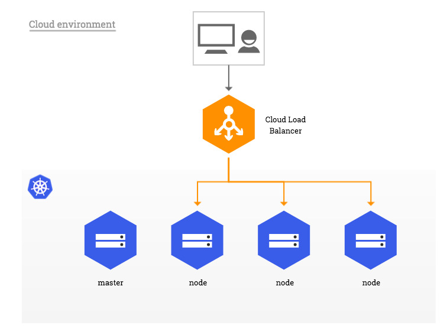
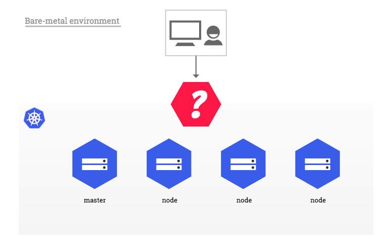

# MetalLB

Trong các môi trường cloud truyền thống, nơi mà network load balancer là khả dụng, 1 tệp cấu hình trong K8s có thể cung cấp 1 điểm kết nối để giao tiếp đến Ingress-Nginx Controller với client bên ngoài, và, trực tiếp đối với các ứng dụng bên trong cluster. Môi trường bare-metal lại thiếu đi đối tượng này, do đó nó cần được setup khác đi một chút để có thể cung cấp 1 access point hoạt động tương tự ra các client bên ngoài.





Phần còn lại của bài viết này sẽ mô tả 1 vài cách tiếp cận để triển khai Ingress-Nginx Controller trong 1 K8s cluster bare-metal

## MetalLB

[MetalLB](https://metallb.universe.tf/) cung cấp 1 giải pháp network load-balancer cho K8s cluster mà không chạy trên 1 nền tảng cloud hỗ trợ điều này. MetalLB cho phép sử dụng LoadBalancer Service trong bất kỳ cluster nào.

Hình dưới đây cho thấy cách mà Layer 2 configuration mode của MetalLB cùng với NGINX Ingress controller trong 1 K8s cluster mà có nodes public. Trong chế độ này, 1 node sẽ tiếp nhận tất cả traffic cho ```ingress-nginx``` Service IP. Chi tiết được đề cập ở [Traffic policies](https://metallb.universe.tf/usage/#traffic-policies)


Trước khi cài đặt MetalLB, hãy chắc chắn thỏa mãn hết điều kiện của nó. Ví dụ như network addon, MetalLB sẽ hoạt động tốt với Flannel, Cilium,.. trong khi đối với Calico thì sẽ có 1 vài known issues.

Nếu ta cài đặt MetalLB trên nền tảng cloud (not usual) thì sẽ cần phải xem [cloud tương thích](https://metallb.universe.tf/installation/clouds/) (hầu hết không hỗ trợ)

MetalLB có thể cài đặt bằng 3 cách: K8s manifest file, Kustomize, Helm.

### Chuẩn bị

**Nếu** bạn đang sử dụng kube-proxy ở **IPVS** mode, từ phiên bản K8s 1.14.2 trở đi bạn sẽ phải kích hoạt hạn chế ARP mode.

Để làm điều này, hãy chỉnh sửa configmap của kube-proxy

```sh
kubectl edit cm -n kube-system kube-proxy
```

và thiết lập

```sh
apiVersion: kubeproxy.config.k8s.io/v1alpha1
kind: KubeProxyConfiguration
mode: "ipvs"
ipvs:
  strictARP: true
```

Bạn cũng có thể thêm configuration snippet vào kubeadm-config. Hoặc đơn giản hơn, hãy thực hiện lệnh sau (không khuyến khích):

```sh
kubectl get configmap kube-proxy -n kube-system -o yaml | \
sed -e "s/strictARP: false/strictARP: true/" | \
kubectl apply -f - -n kube-system
```

### Cài đặt với Manifest

Để cài đặt MetalLB, hãy áp dụng manifest file sau:

```sh
kubectl apply -f https://raw.githubusercontent.com/metallb/metallb/v0.13.9/config/manifests/metallb-native.yaml
```

Lệnh trên sẽ deploy MetalLB vào cluster dưới namespace ```metallb-system```. Các thành phần trong file manifest này bao gồm:
- ```metallb-system/controller``` deployment. Đây là 1 controller toàn cluster sử dụng để xử lý phân phối IP address
- ```metallb-system/speaker``` daemonset. Đây là 1 thành phần mà đưa ra protocol mà bạn sử dụng để giúp service reachable
- Các service account cho controller và speaker, cùng với quyền RBAC mà các thành phần này cần để hoạt động

### Cài đặt với Kustomize

Bạn có thể cài đặt MetalLB với Kustomize bằng việc trỏ đến 1 file kustomization từ xa.

Trong ví dụ sau đây, ta deploy MetalLB với native bgp:

```sh
#kustomization.yaml
namespace: metallb-system

resources:
  - github.com/metallb/metallb/config/native?ref=v0.13.9
```

### Cài đặt với Helm

Bạn có thể cài đặt MetalLB với Htlm bằng cách sử dụng Helm chart repository ```https://metallb.github.io/metallb```

```sh
helm repo add metallb https://metallb.github.io/metallb
helm repo update
helm search repo metallb
helm pull metallb/metallb --version 0.13.9
tar -xzf metallb-0.13.9.tgz
cp metallb/values.yaml values-metallb.yaml
k create ns metallb-system
helm -n metallb-system install metallb metallb/metallb -f values-metallb.yaml
```

Thêm label vào namespace mà MetalLB được cài đặt

```sh
  labels:
    pod-security.kubernetes.io/enforce: privileged
    pod-security.kubernetes.io/audit: privileged
    pod-security.kubernetes.io/warn: privileged
```

### Cấu hình MetalLB

MetalLB cần 1 pool địa chỉ IP để sử dụng cho ```ingress-nginx``` service. Pool này có thể chỉ định thông qua ```IPAddressPool``` object ở trong cùng namespace với MetalLB controller. 

Tạo 1 object với kind IPAddressPool như sau

```sh
apiVersion: metallb.io/v1beta1
kind: IPAddressPool
metadata:
  name: default
  namespace: metallb-system
spec:
  addresses:
  - 203.0.113.10-203.0.113.100
  autoAssign: true
---
apiVersion: metallb.io/v1beta1
kind: L2Advertisement
metadata:
  name: default
  namespace: metallb-system
spec:
  ipAddressPools:
  - default
```

```sh
kubectl apply -f ipaddresspool.yaml
```

Sau đó kiểm tra xem ingress-nginx-controller đã được cấp IP chưa

```sh
k get svc -n ingress-nginx
```


Sau khi MetalLB thiết lập external IP cho ```ingress-nginx``` LoadBalancer Service, các mục tương ứng được tạo trong bảng NAT iptables và node với IP được chọn sẽ bắt đầu phản hồi yêu cầu HTTP request trên port được thiết lập ở LoadBalancer Service:

```sh
curl -D- http://103.124.51.184 -H 'Host: myapp.example.com'
```


### Thông qua 1 NodePort Service

Trong cấu hình này, NGINX container vẫn còn tách biệt với host network. Và kết quả là nó có thể bind vào bất kỳ port nào, bao gồm cả HTTP port mặc định như 80 hay 443. Tuy nhiên, do cách ly container namespace, 1 client nằm ngoài cluster network (như mạng công cộng) sẽ không truy nhập được Ingress host thông qua port 80 và 443. Thay vào đó, client từ bên ngoài phải kết nối thông qua NodePort được phân bố cho ```ingress-nginx` service


Ví dụ

```sh
ubuntu@k8s-master1:~/yaml-files/ingresses/metallb$ k get svc -n ingress-nginx
NAME                                 TYPE           CLUSTER-IP       EXTERNAL-IP    PORT(S)                      AGE
ingress-nginx-controller             LoadBalancer   10.103.175.224   103.159.51.165   80:31090/TCP,443:30741/TCP   59m
ingress-nginx-controller-admission   ClusterIP      10.98.48.41      <none>         443/TCP                      59m
```

Thì khi truy cập từ bên ngoài cluster, ta phải nhập đường dẫn ```http://myapp.example.com:31090``` và tên miền ```myapp.example.com``` phải được phân giải thành External IP của service (trong ví dụ trên là 103.159.51.165)

Một vài điều cần lưu ý với cách tiếp cận này:

- **Địa chỉ IP nguồn**

Service với type NodePort sẽ mặc định thực hiện biên dịch source address. Điều này nghĩa là IP nguồn của HTTP request sẽ luôn là IP của nodes mà tiếp nhận request đó (nếu đứng ở góc nhìn của NGINX)

Cách giải quyết là thiết lập giá trị ```externalTrafficPolicy``` của ```ingress-nginx``` service spec thành ```Local```

**Tuy nhiên thiết lập này sẽ loại bỏ các gói tin gửi đến K8s node mà không được schedule pods nào của NGINX Ingress controller**. Ví dụ:

Ta có 3 node như sau

```sh
$ kubectl get node
NAME     STATUS   ROLES    EXTERNAL-IP
host-1   Ready    master   <None>
host-2   Ready    node     <None>
host-3   Ready    node     <None>
```

Với 1 ```ingress-nginx-controller``` deployment tạo 2 replicas là

```sh
kubectl -n ingress-nginx get pod -o wide
NAME                                       READY   STATUS    IP           NODE
default-http-backend-7c5bc89cc9-p86md      1/1     Running   172.17.1.1   host-2
ingress-nginx-controller-cf9ff8c96-8vvf8   1/1     Running   172.17.0.3   host-3
ingress-nginx-controller-cf9ff8c96-pxsds   1/1     Running   172.17.1.4   host-2
```

Request gửi đến ```host-2``` và ```host-3``` sẽ được forward đến NGINX, và client IP được giữ nguyên, trong khi request đến ```host-1``` thì bị loại bỏ vì không có NGINX replica nào chạy ở node này cả.

- **Ingress status**

Vì NodePort Service không có 1 LoadBalancerIP được chỉ định theo định nghĩa, Ingress-Nginx Controller sẽ không cập nhật trạng thái của Ingress object nó quản lý.

```sh
kubectl get ingress
NAME           HOSTS               ADDRESS   PORTS
test-ingress   myapp.example.com             80
```

Mặc dù không có 1 load balancer nào cung cấp 1 IP address cho Ingress-Nginx Controller, ta vẫn có sử dụng thiết lập ```externalIPs``` của ```ingress-nginx``` service để buộc cập nhật status của tất cả Ingress objects.

Ví dụ:

Ta có 3 node

```sh
$ kubectl get node
NAME     STATUS   ROLES    EXTERNAL-IP
host-1   Ready    master   <None>
host-2   Ready    node     <None>
host-3   Ready    node     <None>
```

Giờ thay đổi spec của ```ingress-nginx``` service một chút

```sh
spec:
  externalIPs:
  - 203.0.113.1
  - 203.0.113.2
  - 203.0.113.3
```

Và các ingress sẽ được cập nhật

```sh
$ kubectl get ingress -o wide
NAME           HOSTS               ADDRESS                               PORTS
test-ingress   myapp.example.com   203.0.113.1,203.0.113.2,203.0.113.3   80
```

- **Redirects**

NGINX không nhận biết về việc chuyển đổi Port được thực hiện bởi NodePort Service, và việc tạo URL redirect được thực hiển bởi backend app phải bao gồm thông tin về NodePort và proxy (nếu có) để đảm bảo rằng external clients có thể truy cập được đến dịch vụ

Ví dụ:

Redirect khởi tạo bởi NGINX, cho HTTP đến HTTPS hoặc domain đến www.domain, được tạo ra không bao gồm NodePort

```sh
curl -D- http://myapp.example.com:30100`
HTTP/1.1 308 Permanent Redirect
Server: nginx/1.15.2
Location: https://myapp.example.com/  #-> missing NodePort in HTTPS redirect
```

### Thông qua host network

Trong 1 setup nơi mà không có 1 external load balancer nào khả dụng nhưng sử dụng NodePort không phải là lựa chọn, ta có thể thiết lập ```ingress-nginx``` pods sử dụng network của host mà nó chạy thay vì 1 dedicated network nào khác. Lợi ích của cách tiếp cận này là Ingress-Nginx Controller có thể bind port 80 và 443 thẳng vào K8s node network interface mà không phải chuyển port bởi 1 NodePort service nào cả.

**Lưu ý:** Cách sử dụng này không cần 1 Service nào để expose Ingress-Nginx Controller cả. Do đó ta nên xóa nó đi nếu có tồn tại.

Điều này có thể thực hiện bằng cách kích hoạt tùy chọn ```hostNetwork```  trong spec của Pod

```sh
template:
  spec:
    hostNetwork: true
```

**Lưu ý bảo mật:** Kích hoạt tùy chọn này sẽ expose mọi system daemon đến Ingress-Nginx Controller trên mọi network interface, bao gồm cả loopback. Hãy tính toán kỹ rủi ro trước khi thực hiện.

Ví dụ:

Ta có deployment ```ingress-nginx-controller``` bao gồm 2 replicas, NGINX pods kế thừa từ IP address của host thay vì 1 internal pod IP:

```sh
$ kubectl -n ingress-nginx get pod -o wide
NAME                                       READY   STATUS    IP            NODE
default-http-backend-7c5bc89cc9-p86md      1/1     Running   172.17.1.1    host-2
ingress-nginx-controller-5b4cf5fc6-7lg6c   1/1     Running   203.0.113.3   host-3
ingress-nginx-controller-5b4cf5fc6-lzrls   1/1     Running   203.0.113.2   host-2
```

Một hạn chế lớn của cách tiếp cận này là sẽ chỉ có 1 Ingress-Nginx Controller Pod nên được schedule trên mỗi node, vì bind trùng 1 port trên cùng 1 network interface là không thể. Pods mà không được schedule vì lỗi này sẽ có event như sau:

```sh
$ kubectl -n ingress-nginx describe pod <unschedulable-ingress-nginx-controller-pod>
...
Events:
  Type     Reason            From               Message
  ----     ------            ----               -------
  Warning  FailedScheduling  default-scheduler  0/3 nodes are available: 3 node(s) didn't have free ports for the requested pod ports.
```

Một cách để chắc chắn chỉ tạo ra các Pods có thể được schedule là triển khai Ingress-Nginx Controller là 1 Daemon thay vì Deployment.

*Thông tin thêm: DaemonSet schedule chính xác 1 loại Pod trên mỗi node, bao gồm cả masters, trừ khi node đó được cấu hình để từ chối pods này*


Cách tiếp cận sử dụng Host network có 1 vài điều cần phải lưu ý như sau:

- **DNS resolution**

Pod được thiết lập với ```hostNetwork: true``` không sử dụng internal DNS resolver (như kube-dns hay CoreDNS), trừ khi ```dnsPolicy``` của chúng được đặt thành ```ClusterFirstWithHostNet```.

- **Ingress status**

Vì không có Service nào được sử dụng để expose Ingress-Nginx Controller trong 1 thiết lập sử dụng host network, default ```--publish-service``` flag được sử dụng trong tiêu chuẩn cloud setup không được áp dụng và trạng thái của các đối tượng Ingress sẽ giữ trắng

```sh
$ kubectl get ingress
NAME           HOSTS               ADDRESS   PORTS
test-ingress   myapp.example.com             80
```

Thay vào đó, và vì bare-metal nodes thường không có ExternalIP, chúng sẽ cần được kích hoạt ```--report-node-internal-ip-address``` flag, điều này đặt trạng thái của tất cả ingress object thành internal IP address của tất cả nodes chạy Ingress-Nginx Controller

Ví dụ:

Ta có Daemonset ```ingress-nginx-controller``` mà có 2 replicas như sau

```sh
$ kubectl -n ingress-nginx get pod -o wide
NAME                                       READY   STATUS    IP            NODE
default-http-backend-7c5bc89cc9-p86md      1/1     Running   172.17.1.1    host-2
ingress-nginx-controller-5b4cf5fc6-7lg6c   1/1     Running   203.0.113.3   host-3
ingress-nginx-controller-5b4cf5fc6-lzrls   1/1     Running   203.0.113.2   host-2
```

Controller sẽ đặt status của Ingress object nó quản lý thành như sau:

```sh
$ kubectl get ingress -o wide
NAME           HOSTS               ADDRESS                   PORTS
test-ingress   myapp.example.com   203.0.113.2,203.0.113.3   80
```

### Sử dụng 1 self-provisioned edge

Tương tự đối với môi trường cloud, cách triển khai này cần 1 edge network component cung cấp 1 public entrypoint đến K8s cluster. Edge component này có thể là phần cứng (như vendor appliance) hoặc phần mềm (như HAProxy) và thường được quản lý bên ngoài K8s cluster.

